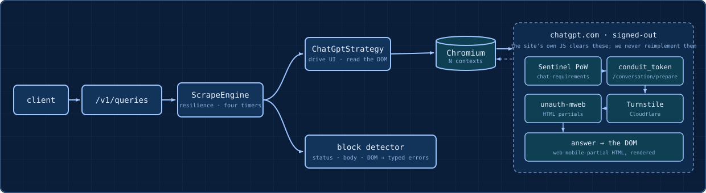

# Hermod

[](LICENSE) [](package.json) [](package.json) [](test/) [](https://github.com/klaiderman/hermod)

Hermod answers an LLM prompt by driving a real, signed-out browser to ChatGPT's own web UI, submitting the prompt the way a person would, and reading the answer back as normalized JSON. There is no model and no API key inside Hermod: it never calls the OpenAI API. The answer comes out of the site's own front end, and Hermod is the layer that drives that front end, classifies what comes back, and refuses to dress a block up as a success.

The name is Hermod, the Norse messenger who rode down and past the gate of Hel to bring a message back from the dead. That is the job here: cross the anti-bot barrier, bring back the oracle's answer, and when the gate holds, come back and say so plainly rather than inventing one.

## Contents

- [Why](#why)
- [Architecture](#architecture)
- [How it works](#how-it-works)
- [Design notes](docs/design-notes.md)
- [Install](#install)
- [Using it](#using-it)
- [Conversations](#conversations)
- [Testing](#testing)
- [The audit](#the-audit)
- [Roadmap](#roadmap)
- [Scope and ethics](#scope-and-ethics)

## Why

Collecting answers from consumer LLM sites at scale is hard for reasons that have nothing to do with the answer: the sites are JavaScript-heavy, gated by anti-bot challenges and rate limits, and increasingly hostile to anything that looks automated. Doing it _signed-out_, with no account and no cookies, throws away every shortcut. You can't lean on a session token or the documented API, so you have to earn each answer through the same front door a human uses.

The interesting constraint is that the front door is the whole point. The reliable way through a challenge is not to reverse-engineer it, it is to let the site's own JavaScript solve it inside a real browser and then read the result. That inverts the usual instinct: you stop fighting the page and start driving it, and it is what keeps the thing working when the site changes its internals next week.

And the genuinely hard part isn't getting one answer, it is being honest about the ones you don't get. A challenge page, a rate-limit, a stream that drops halfway: each of those is a different, classifiable outcome, and the discipline of the whole service is turning them into typed errors instead of returning a blank, a half-answer, or a challenge screen as though it were the model talking. What reaches the caller is either a real answer or a precise reason there isn't one.

## Architecture

<p align="center">
  
</p>

A request comes through one thin controller into the `ScrapeEngine`, which is the site-agnostic hub: it acquires a browser context, wraps the whole attempt in the resilience policy (four timers, bounded retries), drives a per-site strategy, and classifies whatever comes back. The strategy is the only thing that knows a specific site: it drives the signed-out UI in a pooled incognito context and reads the answer off the page, and the block detector turns anything that isn't an answer into a typed error. The engine never knows which site it's driving, so adding a target is one new strategy file plus one registry line, with zero engine edits.

## How it works

A request lands, the DTO is validated, and the engine asks the registry for a strategy by source name. It acquires one incognito browser context from a pool (the concurrency cap), navigates to the signed-out UI, types the prompt, and lets OpenAI's own JavaScript run its challenge (Sentinel proof-of-work, the `conduit_token` handshake, Turnstile). Then it reads the answer as it renders and normalizes it. Completion is decided by the page's own generating control (the Stop button), not by "the text stopped changing", so a turn that pauses to run a web search or a tool isn't mistaken for a finished answer, and when a status placeholder is replaced wholesale by the real answer the provisional text is discarded.

When a request fails, it fails as one of a small set of classified outcomes, each a different way reality diverged from a clean answer:

| status                              | what it means                                                                                                       |
| ----------------------------------- | ------------------------------------------------------------------------------------------------------------------- |
| `TARGET_BLOCKED`                    | A confirmed block (403/503), or a 200-challenge page that outlasted the retries. Terminal, never hammered.          |
| `TARGET_RATE_LIMITED`               | The target returned a 429. Terminal, because backing off harder only makes it worse.                                |
| `TARGET_TIMEOUT`                    | One of four timers fired: navigation, first-byte, inter-delta idle, or the outer wall-clock.                        |
| `PARTIAL_RESPONSE`                  | The stream started and dropped with no terminal marker. The salvage is returned as a typed 504, never as a success. |
| `EMPTY_RESPONSE` / `PARSING_FAILED` | The stream completed but carried nothing, or something the answer schema didn't recognize.                          |

A model refusal ("I can't help with that") is a valid answer, not a block: the detector only fires on anti-bot signals, never on what the model actually said. An ambiguous 200-challenge is retried on a fresh context a bounded number of times, and only if it survives that budget does it settle into a terminal `TARGET_BLOCKED`, so a transient interstitial gets a second chance while a real block is surfaced immediately.

The reasoning behind the less obvious choices (the actual surface signed-out ChatGPT serves, why the answer is read from the DOM, the four-timer split, why headless gets challenged and Xvfb doesn't) is in the [design notes](docs/design-notes.md).

## Install

Get the source (no git needed):

```bash
npx degit klaiderman/hermod hermod
cd hermod
```

**With Docker (recommended).** No Node or browser setup. It runs headful Chromium under Xvfb, so there is no window and no headless fingerprint:

```bash
docker compose up --build
```

That serves on `http://localhost:3000`. Point it at a different target, or tune any of the knobs, by editing `docker-compose.yml` (or `CHATGPT_BASE_URL=... docker compose up`).

**Locally (Node 20+).** `npm install` also pulls the Chromium that Patchright drives, and the app refuses to start unless `CHATGPT_BASE_URL` is set:

```bash
npm install
cp .env.example .env
npm run start:dev
```

## Using it

One endpoint. Send a prompt, get a normalized answer:

```bash
curl -X POST http://localhost:3000/v1/queries \
  -H "Content-Type: application/json" \
  -d '{ "source": "chatgpt", "prompt": "Which language spoken in Israel?", "parse": true }'
```

```json
{
  "results": [
    {
      "source": "chatgpt",
      "content": {
        "prompt": "Which language spoken in Israel?",
        "response_text": "Hebrew is the primary and official language...",
        "markdown_text": "...",
        "citations": [{ "title": "...", "url": "..." }],
        "llm_model": null,
        "conversation_id": "e94b1f8a-2c1d-4b7e-9f3a-8d5e0c7a1b22",
        "search_queries": []
      },
      "status_code": 200
    }
  ],
  "meta": { "request_id": "...", "duration_ms": 4821 }
}
```

`response_text` is the answer as plain text (typographic punctuation, curly quotes, dashes, ellipses, is normalized to ASCII, and zero-width and control glyphs are stripped) and `markdown_text` keeps the raw markdown verbatim. `conversation_id` is always returned: the server mints one when you don't send it, and reusing it continues the same chat (see [Conversations](#conversations)). `llm_model` and `search_queries` come back null or empty on the signed-out surface, which doesn't expose a model id or the model's search queries; they populate on the authenticated `backend-api` surface that does expose them, as `citations` does whenever the answer carries them. Nothing is guessed: a field the page doesn't give up stays null. `parse=false` returns `response_text` as the raw markdown with everything else nulled (except `conversation_id`). `geo_location` is accepted and validated but currently inert (see the proxy seam in the design notes). Every request is tagged with a `request_id` that honors an inbound `X-Request-Id`, is echoed on the response header, and is threaded through every log line.

The request body: `source` and `prompt` are required; `parse` (default `true`), `conversation_id`, and `geo_location` are optional.

Failures come back classified, never as `{ "error": "something went wrong" }`:

```json
{
  "error": { "code": "TARGET_BLOCKED", "message": "...", "retryable": false },
  "meta": { "request_id": "..." }
}
```

| `error.code`          | HTTP | retryable                                      |
| --------------------- | ---- | ---------------------------------------------- |
| `INVALID_REQUEST`     | 400  | no                                             |
| `UNSUPPORTED_SOURCE`  | 422  | no                                             |
| `TARGET_RATE_LIMITED` | 429  | no                                             |
| `TARGET_BLOCKED`      | 403  | no (a 200-challenge is retried, then terminal) |
| `TARGET_TIMEOUT`      | 504  | inner timers yes, wall-clock no                |
| `PARTIAL_RESPONSE`    | 504  | no (salvage returned in `partial`)             |
| `EMPTY_RESPONSE`      | 502  | yes                                            |
| `PARSING_FAILED`      | 502  | no                                             |
| `TARGET_UNAVAILABLE`  | 503  | no                                             |
| `INTERNAL_ERROR`      | 500  | no                                             |

This is a backend service, not an MCP server or an agent tool: you call it over HTTP and it drives a browser on the other side. It ships as a Docker image (see [Install](#install)) that runs the browser headful under Xvfb, so there is no window and no headless fingerprint.

## Conversations

A single query is stateless, but you can hold a multi-turn chat. Every response carries a `conversation_id`, and you get one of two behaviours:

- **Omit it** and the server mints a fresh id and returns it. That is a brand-new, isolated chat.
- **Send it back** on the next request and the follow-up is typed into the same signed-out ChatGPT page, so the model still has the context. Send an id it has never seen and it simply opens a new chat under that id.

```bash
# Turn 1: no id sent. The response comes back with a generated conversation_id.
curl -s -X POST http://localhost:3000/v1/queries \
  -H "Content-Type: application/json" \
  -d '{ "source": "chatgpt", "prompt": "My name is Gilad." }'

# Turn 2: send that id back, and it remembers.
curl -s -X POST http://localhost:3000/v1/queries \
  -H "Content-Type: application/json" \
  -d '{ "source": "chatgpt", "prompt": "What is my name?", "conversation_id": "<id from turn 1>" }'
# -> "Your name is Gilad."
```

The state is the live browser page, not a saved transcript, so it is deliberately ephemeral and held in memory only. A conversation borrows one context from the same pool and stays live until the earliest of: the process (and its Chromium) stopping, `CONVERSATION_TTL_MS` of idle (default 5 minutes), or eviction once `POOL_MAX` conversations are already open (the least-recently-used one is closed). After any of those, reusing the id transparently starts a fresh chat with no memory. Nothing is written to disk. Durable resume across restarts (by persisting ChatGPT's own conversation handle) is a [roadmap](#roadmap) item, not built.

## Testing

```bash
npm test
npm run test:e2e
```

The 47 unit tests cover each piece in isolation (SSE framing, the block detector, the markdown stripper and its ASCII normalization, the DTO) and drive the whole engine against a fake strategy with tiny configured timeouts, so every failure path the assignment asks about (validation, unsupported source, success, timeout, rate-limit, blocked, retry, parse-failure) plus the conversation paths (minting an id, opening on a fresh id, continuing in the same page) run deterministically in milliseconds with no browser and no waiting. The 9 e2e tests exercise the real HTTP contract with the browser mocked, plus a real headless Chromium against a `page.route`-stubbed network to prove the capture and block-detection paths against actual DOM. Everything runs on fixtures, so code correctness is decoupled from whatever the live site is doing that day.

## The audit

The interesting half of the work was running it against the real site, which a fixture will never do honestly. Three things fell out of it.

Driving it live immediately surfaced a **crash bug** the unit tests couldn't: `waitForResponse` is armed before the prompt is submitted, and when a submit step failed the promise was left unawaited, so on context teardown it rejected with "Target page has been closed" as an unhandled rejection that took the whole process down. Fixed by keeping it handled and adding a process-level guard so no stray browser promise can ever kill the service.

It also corrected a **wrong assumption baked into the plan**: signed-out ChatGPT doesn't serve the classic anonymous JSON event-stream, it serves an `unauth-mweb` surface that renders the answer into the DOM as HTML partials. So `waitForResponse` on the old endpoint never resolved. The strategy was re-pointed to an incremental DOM read; the SSE-JSON parser stays for the authenticated surface. And a smaller finding underneath it: **Patchright's stealth disables `addInitScript`/`exposeFunction`**, which killed the in-page streaming tee I'd built first. All three, plus the headless-vs-Xvfb behaviour, are written up in the [design notes](docs/design-notes.md).

Separately, an adversarial pass over the error taxonomy and resilience wiring against the spec turned up one real defect: an exhausted challenge surfaced with `retryable: true`, inviting a client to re-hammer a settled block, now fixed so it lands as a terminal `TARGET_BLOCKED`.

A later live run exposed a **completion-detection bug**: a prompt that triggered the web-search tool returned "Searching the web" as the answer. The DOM read had inferred completion from text-stability, and the tool-status placeholder sat still long enough to trip that timer before the real answer rendered. A live DOM spike showed the honest signals: the page's own Stop control marks when generation actually ends, and the answer _replaces_ the placeholder as a wholesale (non-prefix) text change. Completion now keys on the generating control rather than stillness, and a non-prefix replacement resets the accumulated text, so any tool or status placeholder, in any wording, is discarded when the real answer lands, with no hard-coded placeholder strings.

## Roadmap

- **Proxy pool and geo routing.** The `geo_location` field and the `resolveProxy(geo)` seam exist; wiring a residential or mobile proxy provider there is the only change needed to make geographic behaviour real and to spread block risk across IPs.
- **True streaming under Patchright.** The DOM read gives ordered deltas but not raw byte-level streaming. CDP `Fetch.takeResponseBodyAsStream` would give a genuinely incremental SSE read without reintroducing the detectable in-page tee.
- **Durable conversations.** Multi-turn chat works (see [Conversations](#conversations)) but the state is an in-memory browser page bounded by an idle TTL and an LRU cap, so it does not survive a restart. Persisting ChatGPT's own conversation handle and re-opening a page from it would let a caller resume any id, anytime.
- **DOM citation extraction.** On the signed-out surface the answer's source chips render into the DOM but are not yet lifted into `citations[]`, so a cited source can trail into `response_text` as stray text. Parsing them into the structured field is a contained accessor change.
- **At-scale operability.** Per-target block-rate observability (the verdicts are already logged), a real async job queue behind the sync endpoint so a slow browser turn doesn't hold an HTTP connection, and horizontal scale (conversations are process-local today, so multiple replicas would need sticky routing or a shared session map).
- **Gemini.** Not implemented on purpose: signed-out Gemini needs an account cookie, which crosses the no-login boundary. The investigation is in the design notes; adding it is one strategy file if a viable signed-out path appears.

## Scope and ethics

This is an authorized exercise. It drives the site's own visible, signed-out UI, lets the site's own JavaScript run any challenge, and detects-and-reports blocking rather than circumventing it. It defeats no authentication, uses no one's credentials, and ships no CAPTCHA-solving, token-forging, or fingerprint-spoofing. Scraping these signed-out surfaces is against the targets' terms of service; the honest-limitations writing here and in the design notes (why signed-out Gemini isn't viable, why headless gets challenged, where the real-browser-vs-live-site probabilism lives) is the point, not a disclaimer.
